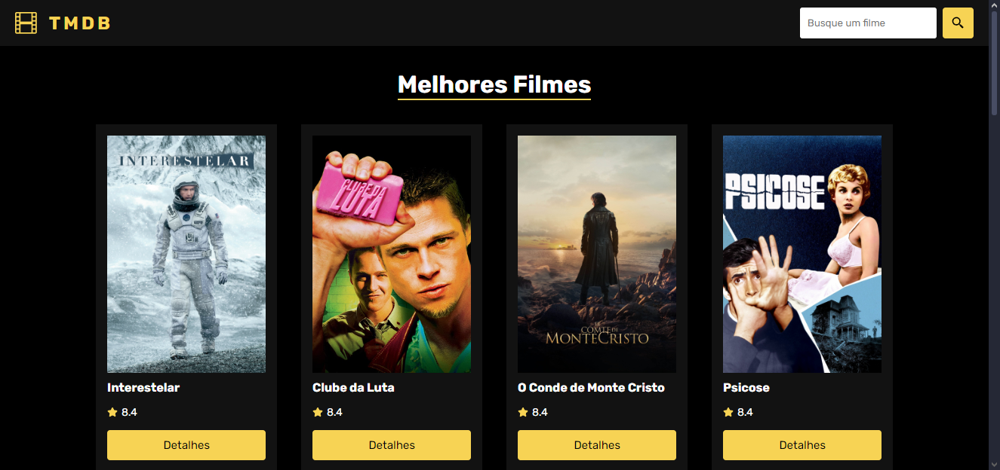
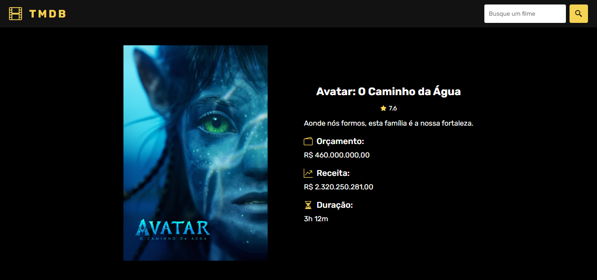

# Biblioteca de Filmes

Feito com React JS e utilizando a api [TMDB](https://developer.themoviedb.org/docs/getting-started) a aplicação é capaz de:

- Buscar por filmes
- Mostrar os filmes com maiores notas
- Exibir detalhes sobre determinado filme

🖥 Veja o site aqui -> https://filmes-tmdb-alpha.vercel.app

## Preview do site

